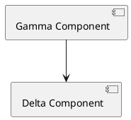

# Diagrams to convert

A prose paragraph before the diagrams.

```mermaid
flowchart LR
    Alpha[Alpha Component] --> Beta[Beta Component]
```

A prose paragraph between the diagrams.

```plantuml
@startuml
component "Gamma Component" as Gamma
component "Delta Component" as Delta
Gamma --> Delta
@enduml
```

A prose paragraph after the diagrams.
