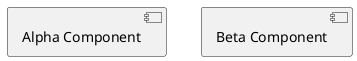

```plantuml
@startuml
component "Alpha Component" as Alpha
component "Beta Component" as Beta
@enduml
```
===
---
type: LAYOUT
---
```json
{
  "size": {
    "width": 1024,
    "height": 768
  },
  "positions": {
    "Alpha": { "x": 80, "y": 80 },
    "Beta": { "x": 380, "y": 80 }
  }
}
```
